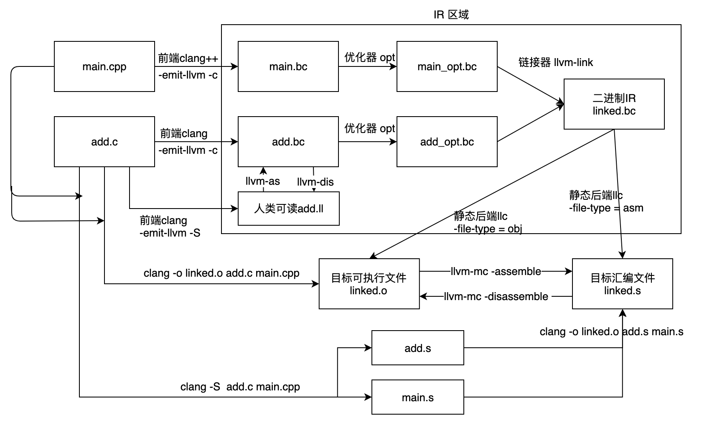

[toc]


# MIPS ISA and ABI

Book

[Computer Organization And Design(5th Edition) - MIPS.zip](https://github.com/QSCTech/zju-icicles/raw/master/计算机组成/教材/Computer Organization And Design(5th Edition) - MIPS.zip)

[计算机组成与设计：硬件、软件接口（第4版）.pdf](https://github.com/QSCTech/zju-icicles/raw/master/计算机组成/教材/计算机组成与设计：硬件、软件接口（第4版）.pdf)


MIPS official doc

[ Introduction to the MIPS32 Architecture v6.01 (867.62 KB)](https://www.mips.com/?do-download=introduction-to-the-mips32-architecture-v6-01)

[ The MIPS32 Instruction Set v6.06 (2.3 MB)](https://www.mips.com/?do-download=the-mips32-instruction-set-v6-06)

[ MIPS32 Instruction Set Quick Reference v1.01 (155.60 KB)](https://www.mips.com/?do-download=mips32-instruction-set-quick-reference-v1-01)

# Single Cycle MIPS Implementaion

See : 北大-计算机组成原理

# Lab1 Getting Started

## 目标

1. 了解三段式编译器、GCC和LLVM各自的优缺点
2. 了解LLVM的核心概念LLVM IR以及LLVM后端代码生成流程
3. 编译LLVM的MIPS后端，能将示例IR转换为MIPS支持的汇编码

## Prerequisites

LLVM Backend Official Doc

http://llvm.org/docs/CodeGenerator.html

https://llvm.org/docs/WritingAnLLVMBackend.html

TableGen

http://llvm.org/docs/TableGen/index.html

http://llvm.org/docs/TableGen/LangIntro.html

LLVM IR

https://llvm.org/docs/LangRef.html

## 三段式编译器

编译器接受高级源语言编写的程序，将其转换为功能等效且可靠的目标语言程序。由于现代编译器越来越复杂，模块化、可维护、易于扩展的特性也变得愈发重要。一个成功的实践方案是三段式设计，如图A所示。在三段式设计中，编译器被划分为前端、优化器和后端三个部分，中间表示IR（Intermeidate Representation）则是连接各个阶段的枢纽。其中优化器应当是通用的、目标无关的，如图B所示，否则当面对n个不同源语言的前端和m个不同目标机器时，必须实现n * m个编译器。而如果是通用优化器，只需要实现n + m个编译器，显然后者更胜一筹。解释器和即时编译器也同样适用该设计方案，Java虚拟机就使用了Java字节码作为中间表示。


三段式编译器包括以下三个部分：

**前端**：编译器的前端负责解析输入的源程序，将其转化为中间表示IR。如下图所示，编译器的前端主要划分为三个阶段。首先，词法分析器对构成源程序的字符流进行扫描然后根据构词规则识别单词或标记，比如关键字、变量和括号。接下来，语法分析在词法分析的基础上将单词序列组合成如“语句”、“表达式”的各类词法短语，最终的结果常常是一个抽象语法树AST（Abstract Syntax Tree）。语法分析也会判断源程序在结构上是否正确，源程序的结构可以由上下文无关文法描述。最后，语义分析检查程序静态语义的有效性，例如检测参与运算的变量是否是同一类型的，和简单的错误处理。语义分析产生语义标注后的AST，并送入中间代码生成器产生IR。


**中端/优化器**：编译器的中端会对IR进行分析和优化，通常是与源语言和目标机器无关的。

**后端**：将目标无关的IR转换为目标相关的代码，也称为代码生成器。后端最重要的部分包含指令选择、寄存器分配、指令调度和代码发射。此外还有可选的代码优化，但和中端的目标无关优化器不同，后端进行目标相关的代码优化。

## LLVM vs GCC

LLVM和GCC都是实现了三段式设计的编译器

- GCC历史悠久，应用广泛，几乎每个架构的CPU都有GCC支持，而LLVM则支持较少

- LLVM使用C++编写，代码组织良好、清晰规。而GCC使用C编写，代码晦涩难懂，且存在历史遗留问题
- 受益于LLVM对IR的良好设计，LLVM框架为开发者提供了高效的开发环境
- LLVM在开源协议上更具优势，是对商业集成友好的协议

## LLVM IR

作为LLVM核心的IR有三种同质异形的表示：

- 内存中适用于转换处理的C++对象表示
- 磁盘上适用于编译器快速加载和空间高效的二进制 .bc文件
- 磁盘上人类可读的LLVM汇编 .ll文件。


内存中的IR被组织为由模块、函数、基本块和指令组成的层次结构，相关类的定义在include/llvm/IR文件夹下。具体地：

- Module模块类在IR体系中是最高等级的实体，聚合了整个IR的分析和转换过程中使用的所有数据，由多个全局变量、函数以及符号表组成。
- Function函数类包含了函数声明定义、函数体和函数属性。函数体被划分为多个基本块，每个基本块具有唯一的标签并可形成控制流图。
- BasicBlock基本块类封装了一组LLVM IR指令。每个基本块具有唯一的标签，单入口和单出口是其最重要的特点。如此，LLVM便可以了解到当执行该基本块时，直至出口指令前都不会发生跳转而改变控制流，有利于后续分析和优化。
- Instruction指令类是LLVM最基础的数据结构，一条Instruction几乎等价于一条IR，它描述IR指令的操作码、操作数和谓词属性，但额外包含了所处基本块、所处函数等上下文信息。


下图展示了C语言编写的fun函数，在**UPT**平台上所对应的LLVM IR和CFG（Control Flow Graph，控制流图）表示。


​    

从图中可见，IR有以下几个特点：

（1）IR由两部分构成，目标字描述符串和IR代码主体。描述target的datalayout字符串表示不同类型的数据在内存上的布局方式。triple用于识别CPU架构、供应商和操作系统字符串。代码主体由源程序转换而来并保持了模块、函数、基本块和IR指令的层次结构。LLVM标识符有两种基本类型，全局标识符用于表示全局变量和函数名，以“@”字符开头；局部标识符用于表示虚拟寄存器，以“% ”字符开头。fun函数声明包含了参数、返回值和由#0索引的函数属性attributes。函数体被划分为由不同label区分的基本块，使用label引用基本块时和引用局部变量类似。所有函数的第一个基本块都为entry，它是一个特殊的基本块，不可以从任何分支指令进入。每个基本块以br或ret等分支指令作为终止指令，这体现了基本块单入口和单出口的特点。

（2）每一条IR指令都是三地址形式的，并且拥有独立的语言类型，由类型和指令操作码共同决定指令确切的语义。详细的操作和类型信息参考[LLVM语言参考手册](https://llvm.org/docs/LangRef.html)。

（3）LLVM IR是静态单赋值SSA（Static Single Assignment）形式的，每个变量或寄存器一旦被赋予就无法再被改变，因此IR指令拥有无穷多的虚拟寄存器。SSA对简化代码分析的意义是巨大的，use-def链已经天然存在于SSA形式的IR代码中，无需运行额外的程序进行数据流和控制流分析。

## Build From Source

```bash
$ git clone https://github.com/llvm-mirror/llvm.git && cd llvm
$ git clone https://github.com/llvm-mirror/clang.git tools/clang
$ mkdir build && cd build
$ cmake -G Ninja -DLLVM_TARGETS_TO_BUILD=Mips ../
$ ninja
```

编译完成后，在构建目录下使用`./llc -version`可得到以下结果


有任何编译问题，请参考[getting-started-with-llvm](https://llvm.org/docs/GettingStarted.html#getting-started-with-llvm)


在生成的可执行文件中，llc表示静态编译器后端，可是使用该工具对LLVM进行编译。

新建以下LLVM IR代码文件：

```
//测试代码test.ll
define i32 @test_imm(i32 %a, i32 %b) #0 {
entry:
    %c = add i32 %a, %b
    %d = add i32 %c, 65537
    ret i32 %d
}

```

使用`./llc -march mips -O0 test.ll`可得以下Mips汇编码：

```assembly
test_imm:                               # @test_imm
	.cfi_startproc
	.frame	$sp,0,$ra
	.mask 	0x00000000,0
	.fmask	0x00000000,0
	.set	noreorder
	.set	nomacro
	.set	noat
# %bb.0:                                # %entry
	addu	$1, $4, $5
	lui	$2, 1
	ori	$2, $2, 1
	addu	$2, $1, $2
	jr	$ra
	nop
```

> 通过-march指定目标架构，-O0 选项表示关闭优化。对于llc和clang，可以添加-Ox开启不同等级的优化，高等级的优化可读性更好，但无优化的代码通常更适合调试


## LLVM IR Tool

LLVM提供了涵盖程序整个生命周期的工具集合，下图展示了围绕LLVM IR的相关工具。参考[LLVM Command Guide](https://llvm.org/docs/CommandGuide/index.html)获取更多工具的详细用法。



- clang是C、C++、Objective C等高级语言的前端，提供前端所有的功能。除此之外，clang还是编译器驱动程序，通过指定参数，clang会隐式地调起相关工具，在内部选择适当的模块生成可执行文件，这也是clang可直接生成可执行文件或汇编文件的原因。clang的-emit-llvm选项告诉clang生成LLVM IR，IR的形式可以为二进制的.bc文件或人类可读的.ll文件，这取决于-c还是-S选项
- **llc**。静态编译器后端，该工具通过特定的后端将LLVM IR转换为目标机器相关的汇编文件或可执行二进制文件。可以使用-march选项指定机器的体系结构，使用-mcpu指定子系列，如果未指定，则自动配置为宿主机环境。通过-filetype指定输出是二进制obj文件或汇编asm文件。完整的后端配置项可通过使用-help选项和-help-hidden获取。
- **llvm-as和llvm-dis**这两个工具在汇编 .ll文件和二进制 .bc文件之间进行IR的相互转换
- **llvm-link。**Bitcode文件链接器，如果要引用文件之外定义的函数或变量，那么llvm-link就会解析符号引用，将多个llvm文件组合成一个文件。
- 目标无关的优化器和分析器，可以传入不同的分析过程名，例如开启mem2reg内存访问优化可使生成的LLVM IR更具可读性。

## LLVM Backend

### 代码生成流程

下图展示了LLVM的代码生成流程，应用程序从高级语言到汇编代码或可执行二进制文件所经历的各个阶段。按照三段式编译流程，首先前端clang和目标无关的优化器opt将源代码转换为LLVM IR，然后后端接受IR并将其转换为目标相关的代码。LLVM的后端代码生成流程可分为几个阶段：


- 指令选择（Instruction Selection）。为了将输入的中间表示LLVM IR转换为目标相关的表示，指令选择从目标机器的指令集中，选择合适的指令对通用的LLVM IR指令进行实现，并保证两者产生相同的预期行为。广义的指令选择包含构建DAG（Directed Acyclic Graph，有向无环图）这一步骤，它将LLVM IR转换为目标无关的SelectionDAG形式，以图的形式表示指令和数据的依赖关系，并基于此进行指令选择。指令选择完成后，IR被转换为由目标指令节点组成的DAG，但此时指令以图的形式存在，无法直接执行，因此需要通过调度确定执行顺序。

- 指令调度（Instruction Scheduling）。指令调度器将DAG中的指令序列化，同时调整指令的执行顺序，尽可能地探索指令级并行性。此时指令操作数仍然和LLVM IR相同，是虚拟寄存器，需要进行寄存器分配。

- 寄存器分配（Register Allocation）。LLVM使用无穷多的虚拟寄存器，但在硬件上指令只能去操作有限的物理寄存器或者是内存。此时需要借助分配算法将虚拟寄存器映射到物理寄存器，必要时需要溢出到内存地址上。

- 序言和尾言插入（Prologue and Epilogue Insertion）。当函数体的指令都生成后，就能够确定函数所需的堆栈大小。此时可以在函数前后安插序言和尾言代码用于分配堆栈或保存、恢复上下文，之前尚未确定的堆栈位置也可以算出正确的偏移。

- 代码发射（Code Emission）。此时的代码已经完全目标相关，不需要再进行任何复杂的分析和转换，可以直接输出为汇编代码或二进制的机器码。LLVM提供了MC框架用于创建代码输出任务。

  

观察到源程序在代码生成中的过程中，LLVM IR被不断地转化为更低层次的表示。具体地，共使用了五种不同级别的指令表示，从高层次到低层次分别为LLVM IR、SelectionDAG、MachineInstr、MCInst和汇编或二进制形式，其中：

- SelectionDAG以有向无环图表示每个指令和数据的依赖关系，非常适合于基于DAG模式匹配的指令选择。
- MI（Machine Instruction）层指的是经过指令调度对SelectionDAG析构后，将MachineInstr作为数据格式处理的阶段，适用于寄存器、堆栈等资源分配任务和目标相关的优化任务。
- MC（Machine Code）层是LLVM建立的一个抽象层，其承载体为MCInst，适用于处理诸如汇编输出、二进制输出和JIT之类的代码发射过程。

### TableGen

TableGen是LLVM框架提供的后端工具，用于描述目标机器的事实信息并辅助代码生成，它提供了简单易读且强大的描述性语言，可以减少开发人员的工作量、降低代码错误率。


TableGen使用.td文件针对目标机器的指令集、寄存器、调用约定和CPU特性等进行描述，这些描述文件将被转换成等价的C++代码（.inc文件）并自动地被引用于后端代码文件中。其工作原理如图所示：


**Explanations**:

- <Target>.td是目标描述文件的全局入口，在这里包含目标的基本信息，并包含其他所有的目标描述文件。所有目标相关的描述文件都继承自位于`include/llvm/Target`目录下内建的Target.td文件，它是体系架构无关的、公用描述接口的全局入口，包括：
  - Target.td ：该文件自身提供了用于描述目标指令集、寄存器等基本信息的目标无关接口；
  - TargetSchedule.td：提供基于ScheduleDAG的指令调度器使用的目标无关接口；
  - TargetSelectionDAG.td：提供基于SelectionDAG的指令选择器使用的目标无关接口；
  - TargetCallingConv.td：提供用于描述调用约定的无关接口。
- 描述寄存器的<Target>RegisterInfo.td（生成<Target>GenRegisterInfo.inc）
- 描述调用约定的<Target>CallingConv.td（生成<Target>GenCallingConv.inc）
- 描述指令集的<Target>InstrInfo.td（生成<Target>GenInstrInfo.inc、<Target> GenDAGISel.inc、<Target>GenInstPrinter.inc以及<Target>GenMCCodeEmitter.inc）
- 影响生成代码质量的指令调度描述<Target>Schedule.td
- 辅助描述指令集、提高代码复用率的指令格式描述<Target>InstrFormat.td。


TableGen内建的td文件预定义了大量的记录用于目标无关的描述，下表列出了重要的基础类/记录，在对应的文件位置查看其定义：


> TableGen提供的描述在一些关键概念上C++类似，其基本语法可查看[TableGen Language Introduction](http://llvm.org/docs/TableGen/LangIntro.html)


# Lab2 了解MIPS Backend

## 目标

了解MIPS后端的代码组织结构，深化理解LLVM后端的代码生成流程，为后续修改MIPS后端作基础理论准备

## Mips目标机器与子目标处理器

首先需要理解MIPS后端的架构，`TargetInfo/MipsTargetInfo.cpp`中注册了4种Mips架构的Target，它们分别是：32位大端、32位小端、64位大端、64位小端Mips机器。Target用以描述目标机器最基本的信息：目标名称、简述和后端名称，其中目标名称作用于llc的-march选项，用于选择后端架构；简述用于llc的-version选项，用于提供帮助信息；后端名称必须对应于Mips.td里使用def定义的Target，从而将此处定义的Target正确关联到描述文件。

```C++
Target &llvm::getTheMipsTarget() {
  static Target TheMipsTarget;
  return TheMipsTarget;
}
Target &llvm::getTheMipselTarget() {
  static Target TheMipselTarget;
  return TheMipselTarget;
}
Target &llvm::getTheMips64Target() {
  static Target TheMips64Target;
  return TheMips64Target;
}
Target &llvm::getTheMips64elTarget() {
  static Target TheMips64elTarget;
  return TheMips64elTarget;
}


extern "C" void LLVMInitializeMipsTargetInfo() {
  RegisterTarget<Triple::mips,
                 /*HasJIT=*/true>
      X(getTheMipsTarget(), "mips", "MIPS (32-bit big endian)", "Mips");

  RegisterTarget<Triple::mipsel,
                 /*HasJIT=*/true>
      Y(getTheMipselTarget(), "mipsel", "MIPS (32-bit little endian)", "Mips");

  RegisterTarget<Triple::mips64,
                 /*HasJIT=*/true>
      A(getTheMips64Target(), "mips64", "MIPS (64-bit big endian)", "Mips");

  RegisterTarget<Triple::mips64el,
                 /*HasJIT=*/true>
      B(getTheMips64elTarget(), "mips64el", "MIPS (64-bit little endian)",
        "Mips");
}

```

在`MipsTargetMachine.cpp`文件中，可以看到4个Target绑定到了2个TargetMachine上，它们分别时表示大端机器的MipsebTargetMachine以及表示小端机器的MipselTargetMachine。一个TargetMachine是Target的包装类，被设计用来捕捉目标平台的抽象特性，是目标后端所有类的中心，和具体的代码生成算法没有任何关系。

由于TargetMachine代表全局的抽象信息，那么具体的实现就落在目标相关的SubTarget类上。TargetMachine通过llc的命令行参数如子目标名和特性字符串选择子目标，当子目标被确定后，UPTSubTarget类的get*Info()方法可完整地获取如寄存器信息、指令信息、栈帧信息、和降低等所有目标信息。

```C++
extern "C" void LLVMInitializeMipsTarget() {
  // Register the target.
  RegisterTargetMachine<MipsebTargetMachine> X(getTheMipsTarget());
  RegisterTargetMachine<MipselTargetMachine> Y(getTheMipselTarget());
  RegisterTargetMachine<MipsebTargetMachine> A(getTheMips64Target());
  RegisterTargetMachine<MipselTargetMachine> B(getTheMips64elTarget());

  PassRegistry *PR = PassRegistry::getPassRegistry();
  initializeGlobalISel(*PR);
  initializeMipsDelaySlotFillerPass(*PR);
  initializeMipsBranchExpansionPass(*PR);
  initializeMicroMipsSizeReducePass(*PR);
  initializeMipsPreLegalizerCombinerPass(*PR);
}
// ......
MipsebTargetMachine::MipsebTargetMachine(const Target &T, const Triple &TT,
                                         StringRef CPU, StringRef FS,
                                         const TargetOptions &Options,
                                         Optional<Reloc::Model> RM,
                                         Optional<CodeModel::Model> CM,
                                         CodeGenOpt::Level OL, bool JIT)
    : MipsTargetMachine(T, TT, CPU, FS, Options, RM, CM, OL, JIT, false) {}

MipselTargetMachine::MipselTargetMachine(const Target &T, const Triple &TT,
                                         StringRef CPU, StringRef FS,
                                         const TargetOptions &Options,
                                         Optional<Reloc::Model> RM,
                                         Optional<CodeModel::Model> CM,
                                         CodeGenOpt::Level OL, bool JIT)
    : MipsTargetMachine(T, TT, CPU, FS, Options, RM, CM, OL, JIT, true) {}

```


在`Mips.td`文件中定义了mips各个子系列的名称及其对应的特性，Mips.td不仅是目标机器描述的全局入口，也负责目标的顶层描述。同一个架构的CPU对一些物理部件和扩展指令集的支持是各不相同的，为此LLVM提供子目标SubTarget的概念。子目标实现了一个公共的目标体系结构并允许依赖不同特性，例如当编译器检测到某子目标具有浮点运算特性时，会选择用硬件实现而不是软件实现的浮点运算。通过预定义记录ProcessorModel，可定义名字为Name的子目标（对应llc的-mcpu=<CPU>选项），它绑定了一系列的特性SubtargetFeature（对应llc的-mattr=<FS>选项）。在子目标生成代码时，可以选择开启或关闭某些机器特性，这通过在特性字符串FS使用“+”和“-”来完成，具体使用方法可通过llc的-mcpu=help选项获得。最后，<Target>.td会被TableGen解析为<Target>GenSubTargetInfo.inc，该文件包含自动生成的C++类和方法，例如ParseSubtargetFeatures()方法，负责解析上述llc的选项从而正确选择子目标。

```C++
class Proc<string Name, list<SubtargetFeature> Features>
 : ProcessorModel<Name, MipsGenericModel, Features>;

def : Proc<"mips1", [FeatureMips1]>;
def : Proc<"mips2", [FeatureMips2]>;
def : Proc<"mips32", [FeatureMips32]>;
def : Proc<"mips32r2", [FeatureMips32r2]>;
def : Proc<"mips32r3", [FeatureMips32r3]>;
def : Proc<"mips32r5", [FeatureMips32r5]>;
def : Proc<"mips32r6", [FeatureMips32r6]>;

def : Proc<"mips3", [FeatureMips3]>;
def : Proc<"mips4", [FeatureMips4]>;
def : Proc<"mips5", [FeatureMips5]>;
def : Proc<"mips64", [FeatureMips64]>;
def : Proc<"mips64r2", [FeatureMips64r2]>;
def : Proc<"mips64r3", [FeatureMips64r3]>;
def : Proc<"mips64r5", [FeatureMips64r5]>;
def : Proc<"mips64r6", [FeatureMips64r6]>;
def : Proc<"octeon", [FeatureMips64r2, FeatureCnMips]>;
```


可见，子目标以一种插件化的方式实现，因此Mips后端目录下的与扩展指令集相关、子目标特性相关的代码文件如`MicroMips* ,Mips16*,MipsEVA*,MipsDSP*,MipsMSA*，MipsMT*，Mips*FPU`等可以不需要关注。此外一些代码文件与新指令选择框架GlobalISEL相关，它们包括`MipsRegisterBank*,MipsLegailzerInfo*,MipsCallLowering*,MipsInstructionSelector*`等。由于GlobalISel与现有的SelectionDAG选择框架是并行的，且尚未完全成熟，因此这些代码也无需关注。


那么，默认的是哪一款子处理器呢？在`MipsSubTargt.{h,cpp}`关于SubTarget的初始化函数可知，默认的ISA版本为mips32

```C++
MipsSubtarget::MipsSubtarget(const Triple &TT, StringRef CPU, StringRef FS,
                             bool little, const MipsTargetMachine &TM,
                             MaybeAlign StackAlignOverride)
    : MipsGenSubtargetInfo(TT, CPU, FS), MipsArchVersion(MipsDefault),
      IsLittle(little), IsSoftFloat(false), IsSingleFloat(false), IsFPXX(false),
      NoABICalls(false), Abs2008(false), IsFP64bit(false), UseOddSPReg(true),
      IsNaN2008bit(false), IsGP64bit(false), HasVFPU(false), HasCnMips(false),
      HasMips3_32(false), HasMips3_32r2(false), HasMips4_32(false),
      HasMips4_32r2(false), HasMips5_32r2(false), InMips16Mode(false),
      InMips16HardFloat(Mips16HardFloat), InMicroMipsMode(false), HasDSP(false),
      HasDSPR2(false), HasDSPR3(false), AllowMixed16_32(Mixed16_32 | Mips_Os16),
      Os16(Mips_Os16), HasMSA(false), UseTCCInDIV(false), HasSym32(false),
      HasEVA(false), DisableMadd4(false), HasMT(false), HasCRC(false),
      HasVirt(false), HasGINV(false), UseIndirectJumpsHazard(false),
      StackAlignOverride(StackAlignOverride), TM(TM), TargetTriple(TT),
      TSInfo(), InstrInfo(MipsInstrInfo::create(
                    initializeSubtargetDependencies(CPU, FS, TM))),
      FrameLowering(MipsFrameLowering::create(*this)),
      TLInfo(MipsTargetLowering::create(TM, *this)) {

  if (MipsArchVersion == MipsDefault)
    MipsArchVersion = Mips32;

```

> Note: 本课题只关注Mips32，忽略其他架构的后端代码

DataLayout字符串是TargetMachine最重要的数据之一，该字符串根据目标的ABI协议描述不同类型数据在内存中的布局方式。字符串的使用规范为type<size>:<abi>:<preferred>，其中abi指定了大小为size比特的、数据类型为type的最小对齐比特数，而pref对齐指定了可能的最大值，在有益的情况下，LLVM会采用该对齐。DataLayout可以描述的布局方式如表4-1所示，包括了大小端定义、堆栈对齐、基本数据类型的对齐等。

DataLayout，Mips有数个ABI，如下图所示。不同的ABI影响着不同数据类型在内存中的布局方式，本课题重点关注O32。

```C++
static std::string computeDataLayout(const Triple &TT, StringRef CPU,
                                     const TargetOptions &Options,
                                     bool isLittle) {
  std::string Ret;
  MipsABIInfo ABI = MipsABIInfo::computeTargetABI(TT, CPU, Options.MCOptions);

  // There are both little and big endian mips.
  if (isLittle)
    Ret += "e";
  else
    Ret += "E";

  if (ABI.IsO32())
    Ret += "-m:m";
  else
    Ret += "-m:e";

  // Pointers are 32 bit on some ABIs.
  if (!ABI.IsN64())
    Ret += "-p:32:32";

  // 8 and 16 bit integers only need to have natural alignment, but try to
  // align them to 32 bits. 64 bit integers have natural alignment.
  Ret += "-i8:8:32-i16:16:32-i64:64";

  // 32 bit registers are always available and the stack is at least 64 bit
  // aligned. On N64 64 bit registers are also available and the stack is
  // 128 bit aligned.
  if (ABI.IsN64() || ABI.IsN32())
    Ret += "-n32:64-S128";
  else
    Ret += "-n32-S64";

  return Ret;
}
```


## 机器描述

### Register

任何目标机器都应完成<Target>RegisterInfo.td文件对寄存器进行描述。描述寄存器需要Target.td预定义的两个记录Register和RegisterClass，如代码清单所示:

```C++
class Register<string n, list<string> altNames = []> {
    string Namespace = "";  // 寄存器所属命名空间
    string AsmName = n; // 寄存器的名字
    list<string> AltNames = altNames; // 替代名列表
    lxist<Register> Aliases = [];  //  读写此寄存器将读写其他寄存器的列表（别名）
    list<Register> SubRegs = []; // 子寄存器列表
    bits<16> HWEncoding = 0; // 寄存器编码
    list<int> DwarfNumbers = []; // gcc/gdb调试时用于标识寄存器的编号
    ...
}
class RegisterClass<string namespace,list<ValueType> regTypes,int alignment,
     dag regList, RegAltNameIndex idx = NoRegAltName> : DAGOperand


```

其中Register是用于描述寄存器及其交互行为的基础类，最重要的字段是寄存器名、子寄存器、汇编输出和编码等。

注意到Register没有位宽字段，此时需要RegisterClass帮助寄存器进行分类，它定义了每组寄存器可以支持的数据类型，典型的例子是整数、浮点和向量寄存器。寄存器类的参数表示：regList列表里的寄存器支持值类型regTypes，且从内存加载或存储寄存器到内存时需对齐到alignment位。寄存器类还影响寄存器分配，它描述了一组用于寄存器压力模型的、可以互换使用的寄存器，regList中寄存器的排列顺序会影响到LLVM寄存器分配阶段的决策——优先考虑排在前面的寄存器。


MIPS后端中，不同子目标的寄存器没有分开存放，统一定义在MIPSRegisterInfo.td文件中。不同子目标拥有不同类型的寄存器，如以下代码所示：

```C++
// Mips CPU Registers.
class MipsGPRReg<bits<16> Enc, string n> : MipsReg<Enc, n>;

// Mips 64-bit CPU Registers
class Mips64GPRReg<bits<16> Enc, string n, list<Register> subregs>
  : MipsRegWithSubRegs<Enc, n, subregs> {
  let SubRegIndices = [sub_32];
}

// Mips 32-bit FPU Registers
class FPR<bits<16> Enc, string n> : MipsReg<Enc, n>;

// Mips 64-bit (aliased) FPU Registers
class AFPR<bits<16> Enc, string n, list<Register> subregs>
  : MipsRegWithSubRegs<Enc, n, subregs> {
  let SubRegIndices = [sub_lo, sub_hi];
  let CoveredBySubRegs = 1;
}
```

本课题重点关注mips32中的通用寄存器MipsGPRReg：

```C++
let Namespace = "Mips" in {
  // General Purpose Registers
  def ZERO : MipsGPRReg< 0, "zero">, DwarfRegNum<[0]>;
  def AT   : MipsGPRReg< 1, "1">,    DwarfRegNum<[1]>;
  def V0   : MipsGPRReg< 2, "2">,    DwarfRegNum<[2]>;
  def V1   : MipsGPRReg< 3, "3">,    DwarfRegNum<[3]>;
  def A0   : MipsGPRReg< 4, "4">,    DwarfRegNum<[4]>;
  def A1   : MipsGPRReg< 5, "5">,    DwarfRegNum<[5]>;
  ...
  def S7   : MipsGPRReg< 23, "23">,  DwarfRegNum<[23]>;
  def T8   : MipsGPRReg< 24, "24">,  DwarfRegNum<[24]>;
  def T9   : MipsGPRReg< 25, "25">,  DwarfRegNum<[25]>;
  def K0   : MipsGPRReg< 26, "26">,  DwarfRegNum<[26]>;
  def K1   : MipsGPRReg< 27, "27">,  DwarfRegNum<[27]>;
  def GP   : MipsGPRReg< 28, "gp">,  DwarfRegNum<[28]>;
  def SP   : MipsGPRReg< 29, "sp">,  DwarfRegNum<[29]>;
  def FP   : MipsGPRReg< 30, "fp">,  DwarfRegNum<[30]>;
  def RA   : MipsGPRReg< 31, "ra">,  DwarfRegNum<[31]>;

  ...
}
//===----------------------------------------------------------------------===//
// Register Classes
//===----------------------------------------------------------------------===//

class GPR32Class<list<ValueType> regTypes> :
  RegisterClass<"Mips", regTypes, 32, (add
  // Reserved
  ZERO, AT,
  // Return Values and Arguments
  V0, V1, A0, A1, A2, A3,
  // Not preserved across procedure calls
  T0, T1, T2, T3, T4, T5, T6, T7,
  // Callee save
  S0, S1, S2, S3, S4, S5, S6, S7,
  // Not preserved across procedure calls
  T8, T9,
  // Reserved
  K0, K1, GP, SP, FP, RA)>;
```

寄存器描述文件仅仅定义了寄存器的编码和名称，并按可存放的数据类型将其做了分类。事实上，MIPS的ABI约定了每个寄存器的用途，这些约定定义在在<Target>CallingConv.td文件中。


> Reference：[MIPSCallingConventionsSummary](https://courses.cs.washington.edu/courses/cse410/09sp/examples/MIPSCallingConventionsSummary.pdf)


### Calling Conv


所有后端都应在<Target>CallingConv.td中按目标机器ABI规定的调用约定进行描述。具体地，需要指定：

（1）函数参数和返回值是放在寄存器中还是放在栈上（亦或是两者混合）。

（2）函数参数的寄存器分配顺序和支持的数据类型。

（3）哪些寄存器由被调用者保存。

MipsCallingConv.td文件中对mips架构数个版本的调用约定进行描述，本课题重点关注O32，这是教材上比较常用的调用约定。

```C++
//===----------------------------------------------------------------------===//
// Mips O32 Calling Convention
//===----------------------------------------------------------------------===//

def CC_MipsO32 : CallingConv<[
  // Promote i8/i16 arguments to i32.
  CCIfType<[i1, i8, i16], CCPromoteToType<i32>>,

  // Integer values get stored in stack slots that are 4 bytes in
  // size and 4-byte aligned.
  CCIfType<[i32, f32], CCAssignToStack<4, 4>>,

  // Integer values get stored in stack slots that are 8 bytes in
  // size and 8-byte aligned.
  CCIfType<[f64], CCAssignToStack<8, 8>>
]>;

// Only the return rules are defined here for O32. The rules for argument
// passing are defined in MipsISelLowering.cpp.
def RetCC_MipsO32 : CallingConv<[
  // Promote i1/i8/i16 return values to i32.
  CCIfType<[i1, i8, i16], CCPromoteToType<i32>>,

  // i32 are returned in registers V0, V1, A0, A1, unless the original return
  // type was a vector of floats.
  CCIfOrigArgWasNotVectorFloat<CCIfType<[i32],
                                        CCAssignToReg<[V0, V1, A0, A1]>>>,

  // f32 are returned in registers F0, F2
  CCIfType<[f32], CCAssignToReg<[F0, F2]>>,

  // f64 arguments are returned in D0_64 and D2_64 in FP64bit mode or
  // in D0 and D1 in FP32bit mode.
  CCIfType<[f64], CCIfSubtarget<"isFP64bit()", CCAssignToReg<[D0_64, D2_64]>>>,
  CCIfType<[f64], CCIfSubtargetNot<"isFP64bit()", CCAssignToReg<[D0, D1]>>>
]>;
```


```C++
def CSR_O32 : CalleeSavedRegs<(add (sequence "D%u", 15, 10), RA, FP,
                                   (sequence "S%u", 7, 0))>;

```


### Instruction


目标机器应在<Target>InstroInfo.td文件完成对指令集的描述。所有的指令都必须是在Target.td中定义的基础类型Instruction的子类，如代码清单3-9所示，它描述目标处理器的指令格式、指令操作数、指令编码、指令汇编码的输出格式和指令选择的匹配模式等，以及描述指令特性的谓词。

```C++
class Instruction : InstructionEncoding {
    dag OutOperandList; // 定义的操作数列表(For MCInst and MI)
    dag InOperandList; // 使用的操作数列表(For MCInst and MI)
    string AsmString = ""; // 指令的汇编表示
    list<dag> Pattern;  // 匹配模式
    list<Register> Uses = [];  // 将使用的非操作数寄存器
    list<Register> Defs = [];  // 将修改或定义的非操作数寄存器
    list<Predicate> Predicates = []; // 模式匹配时需满足的特定条件列表
    // 大量描述指令特性的谓词
    bit isReturn= 0; // 是否为返回指令
    bit isBranch = 0; // 是否为条件跳转指令
    ...
}
```

Instruction类中出现的dag关键字是TableGen的重要基本类型。本文结合下图对dag进行解释，该图展示了如何描述一个简单指令ADDI32（目标XXX的寄存器间32位加法指令）。一个dag对象用来表示一个有向无环子图，在Instruction中它出现在以下几个字段中：


（1）InOperandList和OutOperandList，这两个字段表示以ins（只接受输入）及outs（只进行输出）作为操作符的、只具有单个节点的dag，可理解为指令的输入和输出操作数。在图3-3中，OutOperandList的值为(outs I32Reg:$d)，其中outs表明该节点定义值，值的类型由目标定义的寄存器类I32Reg指定，必须是i32的寄存器，且用变量d表示；同理，ins表示节点使用值，s1和s2两个变量用于绑定输入值并且同样属于I32Reg。尽管ins和outs是dag类型，但它们并不影响指令选择，而是用于MI层和MC层的任务，例如I32Reg告诉运行在MI层的寄存器分配器从指定寄存器类中选择寄存器，$rd告诉工作在MC层的汇编输出程序如何引用寄存器等。

（2）Pattern，用于在指令选择阶段基于dag的模式匹配。dag上的每个节点为一个SDNode，TableGen在ISD空间预定义了大量的SDNode。如图3-4所示，一个SDNode包括操作码OpCode，描述操作数列表类型的SDTypeProfile，以及描述指令属性的SDNodeProperty。以add指令为例，它绑定ISD空间下的ADD节点，SDIntBinOp表示它是二元运算符并输出一个整型，SDPCommutative和SDNPAssociative表示指令满足结合律和交换律。因此图3-3中定义的pattern含义为：当指令add的两个操作数都是类型为I32Reg的寄存器时，将成功匹配并被替换为目标命名空间XXX下的ADDI32节点，并将操作数绑定到s1、s2和d三个变量上。注意指令选择时，节点使用的仍然是虚拟寄存器，当寄存器分配器将其替换为具体的物理寄存器时，汇编输出或二进制输出器会将物理寄存器的编号填入$s1、$s2和$d中。


（3）Predicates，描述模式匹配时所需的特定条件，仅当满足前置条件时才触发指令匹配

## 指令选择

指令选择必须首先选择实现与输入程序产生相同预期行为的机器指令，产生高效的汇编代码是次要目标，具体可以划分为以下两个子问题：

（1）模式匹配。通过检测并匹配某种模式，决定是否可以使用特定的机器指令替换当前的llvm操作。

（2）模式选择。当存在多种选择时，应该选择哪条指令。

第一个子问题涉及寻找机器指令的候选集，而第二个子问题涉及从这些候选集中选择其中一个子集。后者通常作为一个关于成本的优化问题，每次指令选择都会产生成本，这个成本通常是目标机器执行特定机器指令所需要的机器周期数，优化的目标是最小化所选指令的总成本。换言之，如果指令选择器无法使用其他指令来实现更低成本的汇编码，那么指令选择器就是最优的。

LLVM使用基于DAG的指令选择算法，以有向无换图的形式表示指令和数据的依赖关系。为此需要构建DAG，并在指令选择前做一些必要的目标相关的处理，以一种标准的形式进入选择阶段。指令选择包括Build、Combine、Lower、Legalize和Select几个阶段，如图所示，图右侧展示了代码清单3-10在X86平台下指令选择各个阶段的存在形式并且将变化的部分标红。这些结果来自llc的-view-xxx选项，用于可视化某阶段之前的DAG，例如-view-isel-dags表示进入Select阶段前的DAG。


## 指令调度

指令调度可以在发生在寄存器分配前（pre-RA），也可以发生在寄存器分配后（post-RA）。一方面，在指令选择完成后SelectionDAG仍然是以图形式存在的非线性序列，无法直接执行。为此，pre-RA指令调度将DAG线性化从而确定指令执行顺序。另一方面，现代处理器普遍采用流水线技术，通过将指令的执行分割成一系列独立的步骤来提高指令吞吐量，一些超标量流水的硬件还可以同时执行多条指令或者超长指令字（VLIW）。然而，当同时进入流水的指令相互依赖时，必须阻塞或停顿流水线，否则后续指令将会被错误地执行。因此指令调度（包括pre-RA和post-RA）的另一个任务是在目标资源的限制下尽可能地探索指令级并行性，尽力避免流水线停顿。

获取调度序列最简单的办法就是拓扑排序，不断地从依赖关系图上选择一条指令输出，并将其从依赖关系图中删除，这类调度算法称为列表调度（List Scheduling）。为了尽量避免流水线停顿，应当为当前最高优先级的指令进行编排，常见的启发性方法有：

（1）若候选者使用了一个被占用的资源，则优先级降低（可能与先前的指令产生流水线互锁）；

（2）在控制流图中有较多后继者，则优先级提升（后继指令能以更高的灵活性进行安排）；

（3）该指令处于控制流图的关键路径上，则优先级提升（关键路径决定最少完成时间）；

LLVM采用了这些通用的启发性方法，在所有调度器的父类ScheduleDAG的实现中，就存在关键路径、拓扑排序等基本函数以及优先级队列。除此之外，LLVM后端还使用更多启发性的方法：首先是SelectionDAG上的粘合依赖和控制依赖，其次是寄存器压力、指令时延等，最后针对超标量机器还需要考虑指令对不同资源使用情况。

> 对于指令调度器的具体实现，超出了本文的讨论范围，可参考源码目录下的ScheduleDAG、ScheduleDAGSDNodes、ScheduleDAGInstr等类。
>
> MIPS调度器建模也超出了本文的讨论范围，可参考MipsSchedule.td 和 MipsScheduleGeneric.td

- [ ] 添加示例代码的指令调度结果

## 寄存器分配

指令调度后的MachineInstr是SSA形式的、拥有无限多的虚拟寄存器，但CPU或GPU中的物理寄存器数量是有限的，寄存器分配器作为后端的一个模块负责解决这一矛盾。分配器需要通过分析决定寄存器的活跃区间（live range），将程序中数量无限的虚拟寄存器映射到数量有限的物理寄存器。如果物理寄存器的数量不足以满足虚拟寄存器的需求，就只能映射到内存，此时称为溢出（spill）。溢出会造成额外的加载和存储开销，分配算法的好坏直接决定了程序中寄存器的利用率。

LLVM的寄存器分配器是目标无关的，在目录lib/CodeGen下实现了四种寄存器分配算法：RegAllocBasic.cpp、RegAllocFast.cpp、RegAllocGreedy.cpp和RegAllocPBQP.cpp，可以通过llc中-regalloc=<name>选项指定使用哪一种分配器：

（1）baisc，对应RegAllocBasic。最基本的分配算法实现，可以用来测试错误并作为性能基准。

（2）fast，对应RegAllocFast。此寄存器分配器是调试生成的默认设置。它在基本块级别上分配寄存器，试图尽可能将值保留在寄存器中和重用寄存器。

（3）greedy，对应RegAllocGreedy。默认的分配器，这是一个高度优化的分配器实现，尽可能以最小成本高效地溢出。

（4）pbqp，对应RegAllocPBQP。这个分配器的工作原理是构造一个PBQP问题来表示寄存器分配问题。


>寄存器分配问题是一个NP完全问题，尚无快速有效的求解最优解的算法。历史上出现过的寄存器分配算法有：图着色算法、PBQP算法、线性扫描算法等。但LLVM没有全部支持上述寄存器分配算法，例如图着色。不使用图着色算法的原因是其运行代价高昂，这对于讲究效率的现代编译器是不能接受的。由于现在所有架构的CPU都只有十分有限的寄存器，因此大型程序中必然会存在大量溢出，此时寄存器分配算法更应该关注如何高效地溢出，这也是目前LLVM里默认分配算法的中心思想。限制于文章篇幅，本文不会对寄存器分配算法的实现细节进行讨论。事实上，Java HotSpot（JVM的一个实现）的后端也基于线性扫描算法，文献给出了细致的算法步骤，其关键概念与LLVM的寄存器分配并无出入。


- [ ] 添加示例代码的寄存器分配结果

## 序言和尾言

一个函数的结构应当包括:序言准备(Prologue)，函数体和结束收尾(Epilogue)。序言的目的是为了保存之前程序的执行状态、调整栈指针以及局部函数变量。函数的最后一部分即结束收尾，这一部分主要是用来恢复程序寄存器以及回到函数调用发生之前的状态。LLVM提供了由PEI类来完成序言和尾言的插入，它定义在lib/CodeGen/PrologEpilogInserter.cpp中，如代码清单3-17所示，PEI作用于MachineFunction并主要完成以下三件事：

（1）  建立调用栈帧，在LLVM中称为栈展开（stack unwinding）

（2）  保存、恢复由被调用者保存的寄存器

（3）  解析抽象帧索引

```C++
class PEI : public MachineFunctionPass {
public:
  bool runOnMachineFunction(MachineFunction &MF) {
    const Function &F = MF.getFunction();
    const TargetRegisterInfo *TRI = MF.getSubtarget().getRegisterInfo();
    const TargetFrameLowering *TFI = MF.getSubtarget().getFrameLowering();
   
    // 计算最大调用帧大小,同时清除栈帧建立和销毁的伪指令
    calculateCallFrameInfo(MF);
    // 为被调用者保存的寄存器计算保存/恢复指令应插入的位置
    calculateSaveRestoreBlocks(MF);
    // 可能需要溢出被调用者保存的寄存器（并恢复）
    spillCalleeSavedRegs(MF);
    // 计算实际的栈帧偏移
    calculateFrameObjectOffsets(MF);
    // 主函数,插入序言和尾言
    insertPrologEpilogCode(MF);
    // 解析抽象帧索引MO_FrameIndex并用物理寄存器替换
    replaceFrameIndices(MF);
    ...
  }
}

```


注意到PEI的代码中使用了两个目标相关的信息TargetRegisterInfo和TargetFrameLowering。前者为了获取被调用者保存的寄存器，而后者为了获得目标栈帧信息。TargetFrameLowering类描述了有关目标栈帧布局的信息，包括堆栈增长的方向、对齐方式和局部区域的偏移量（从堆栈指针到第一个可存储局部变量地址的偏移量）。栈帧的描述需要目标实现TargetFrameLowering的子类<Target>FrameLowering类，从而针对栈帧进行降低，使代码向更低的层次转化。

MipsFrameLowering.{h,cpp}定义了一个不同子目标间公用的栈帧父类，即堆栈向下生成，但具体的内存对齐方式不定。两种具体的栈帧布局方式Mips16FrameLowering和MipsSEFrameLowering将根据MipsSubTarget来决定。

```C++
class MipsFrameLowering : public TargetFrameLowering {
protected:
  const MipsSubtarget &STI;

public:
  explicit MipsFrameLowering(const MipsSubtarget &sti, Align Alignment)
      : TargetFrameLowering(StackGrowsDown, Alignment, 0, Alignment), STI(sti) {
  }
  ...
}
/// Create MipsFrameLowering objects.
const MipsFrameLowering *createMips16FrameLowering(const MipsSubtarget &ST);
const MipsFrameLowering *createMipsSEFrameLowering(const MipsSubtarget &ST);
```

## 代码发射


后端的最后一个阶段是将MachinInstr列表输出为汇编或机器代码。LLVM设计了MC框架用于创建汇编、反汇编和代码输出等低级的任务，相关类全部实现在`include/llvm/MC`文件夹下。这些类主要提供的是接口，实现细节应该在特定于目标的子类中填充。各个类的相互作用关系如图所示：


（1）指令打印器MCInstPrinter将一个MCInst格式化为指令的汇编表示并发送到输出流，对应的功能主函数是printInst函数。目标可以有多个 MCInstPrinters，例如 X86的汇编代码有AT&T和Intel两种风格。

（2）指令编码器MCCodeEmitter通过EncodeInstruction函数将MCInst编码为二进制形式并发送到输出流，是另一个特定于目标的组件。

（3） 汇编解析器MCAsmParser允许llvm-mc读取目标相关的.s汇编文件，经过词法分析和语法分析，每条汇编指令和操作数将被表示为MCInst。它依赖MCTargetAsmParser及其子类中特定于目标的解析方法ParseInstruction。

（4）指令解码器MCDisassembler允许llvm-mc将抽象的指令字节解码为MCInst表示，对应功能主函数是getInstruction函数，实践中通常会调用由TableGen自动生成的decodeInstruction来完成，该函数是根据目标的指令描述文件得到的。

（5）AsmPrinter提供了用于指令降低和代码输出的通用功能接口，类似MC层的“门”，经过这扇门，MachineFunction内的每条MachineInstr都会被转化（或降低）为MCInst从而适用MC框架的各种任务。

> 了解功能即可，无需关注实现细节

# Lab3 修改Mips指令选择

## 背景


Mips存在一条名为LUI的指令，它的功能是加载立即数至字的高位：


由于Mips是RISC风格的定长指令集，因此加载大立即数需要分别加载高位和低位：

```asm
lui $s0, upper(big)
ori $s0, $s0, lower(big)
```

例如加载立即数 0x1b236723 到$s0寄存器

```
lui $s0,0x1b23
ori $s0,0x6723
```


**IDEA**: 

观察到LUI的指令编码存在**浪费现象**，如果存在一条能较好地利用编码空间的指令如LBI(Load Big Immediate)，则在加载21 bit 范围内的立即数时只需要使用一条指令，可以提高代码执行效率。

**LBI Performance:**

下图是一个常见的单周期MIPS的数据通路图，其中LUI只需要将立即数补0而无需经过ALU的运算，因此LUI的硬件电路实现简单，时延非常低。LBI与LUI的数据通路非常相似，因此也具有时延低的特点，在实现时只需要将二选一选择器变为三选一选择器并增加相应的控制信号即可。


## 目标

为Mips的LLVM后端添加LBI指令，使得仅当加载超过21bit所能表示的范围时才启用LUI指令，其余情况使用LBI指令。以如下代码为例：

```
//测试代码test.ll
define i32 @test_imm(i32 %a, i32 %b) #0 {
entry:
    %c = add i32 %a, %b
    %d = add i32 %c, 65537
    ret i32 %d
}
```

使用`./llc -march mips -O0 test.ll`可得以下Mips汇编码：

```assembly
test_imm:                               # @test_imm
	.cfi_startproc
	.frame	$sp,0,$ra
	.mask 	0x00000000,0
	.fmask	0x00000000,0
	.set	noreorder
	.set	nomacro
	.set	noat
# %bb.0:                                # %entry
	addu	$1, $4, $5
	lui	$2, 1
	ori	$2, $2, 1
	addu	$2, $1, $2
	jr	$ra
	nop
```

由于此处65537超出了立即数加法指令addi 所能接受的立即数范围，因此不能直接使用addi进行实现，需要将65537分别加载高低位至某个寄存器如`$2`，再使用寄存器间的加法指令add对上述代码进行实现。添加LBI指令后，此处应变为一条立即数加载指令，即`lbi $2, 65537`。

> Implementation Tips:
>
> 1. 修改编译器的指令选择，一般通过修改<Target>InstrInfo.td的模式，复杂的指令选择在<Target>IselDAGToDAG.{h,cpp}中完成。
> 2. 在指令描述文件中使用immediate关键字搜索相关描述代码，明确后端如何区分任意立即数和小立即数
> 3. 寄存器调度对新指令一无所知，因此需要在MipsScheduleGeneric.td文件中，根据LBI使用的物理资源情况，将其添加到合适的位置。事实上，LBi与LUi与完全相同，本实验也不需要了解如何对后端描述调度模型。


## 参考实现

```diff
diff --git a/lib/Target/Mips/MipsInstrFormats.td b/lib/Target/Mips/MipsInstrFormats.td
index 14f01514f33..98336abf248 100644
--- a/lib/Target/Mips/MipsInstrFormats.td
+++ b/lib/Target/Mips/MipsInstrFormats.td
@@ -426,6 +426,16 @@ class LUI_FM : StdArch {
   let Inst{15-0}  = imm16;
 }
 
+class LBI_FM : StdArch {
+  bits<5> rt;
+  bits<21> imm21;
+
+  bits<32> Inst;
+
+  let Inst{31-26} = 0x6;
+  let Inst{25-21} = rt;
+  let Inst{20-0}  = imm21;
+}
 class JALR_FM {
   bits<5> rd;
   bits<5> rs;
diff --git a/lib/Target/Mips/MipsInstrInfo.td b/lib/Target/Mips/MipsInstrInfo.td
index 58167e0f344..f01dc5d37b7 100644
--- a/lib/Target/Mips/MipsInstrInfo.td
+++ b/lib/Target/Mips/MipsInstrInfo.td
@@ -1275,6 +1275,8 @@ def immZExt16  : PatLeaf<(imm), [{
   else
     return (uint64_t)N->getZExtValue() == (unsigned short)N->getZExtValue();
 }], LO16>;
+def immSExt21  : PatLeaf<(imm), [{ return isInt<21>(N->getSExtValue()); }]>;
+
 
 // Immediate can be loaded with LUi (32-bit int with lower 16-bit cleared).
 def immSExt32Low16Zero : PatLeaf<(imm), [{
@@ -1325,7 +1327,6 @@ def immZExtRange2To64 : PatLeaf<(imm), [{
 def ORiPred  : PatLeaf<(imm), [{
   return isUInt<16>(N->getZExtValue()) && !isInt<16>(N->getSExtValue());
 }], LO16>;
-
 def LUiPred : PatLeaf<(imm), [{
   int64_t Val = N->getSExtValue();
   return !isInt<16>(Val) && isInt<32>(Val) && !(Val & 0xffff);
@@ -1427,6 +1428,14 @@ class LoadUpper<string opstr, RegisterOperand RO, Operand Imm>:
   let isReMaterializable = 1;
 }
 
+// Load Big(26-bit) Immediate
+class LoadBigImm<string opstr, RegisterOperand RO, Operand Imm>:
+  InstSE<(outs RO:$rt), (ins Imm:$imm21), !strconcat(opstr, "\t$rt, $imm21"),
+         [], II_LUI, FrmI, opstr>, IsAsCheapAsAMove {
+  let hasSideEffects = 0;
+  let isReMaterializable = 1;
+}
+
 // Memory Load/Store
 class LoadMemory<string opstr, DAGOperand RO, DAGOperand MO,
                  SDPatternOperator OpNode = null_frag,
@@ -2067,6 +2076,8 @@ let AdditionalPredicates = [NotInMicroMips] in {
 
   def LUi   : MMRel, LoadUpper<"lui", GPR32Opnd, uimm16_relaxed>, LUI_FM,
               ISA_MIPS1;
+  def LBi   : MMRel, LoadBigImm<"lbi", GPR32Opnd, i32imm>, LBI_FM,
+              ISA_MIPS1;
 
   /// Arithmetic Instructions (3-Operand, R-Type)
   def ADDu  : MMRel, StdMMR6Rel, ArithLogicR<"addu", GPR32Opnd, 1, II_ADDU, add>,
@@ -3078,6 +3089,9 @@ class LoadRegImmPat<Instruction LoadInst, ValueType ValTy, PatFrag Node> :
 class StoreRegImmPat<Instruction StoreInst, ValueType ValTy> :
   MipsPat<(store ValTy:$v, addrRegImm:$a), (StoreInst ValTy:$v, addrRegImm:$a)>;
 
+let AdditionalPredicates = [NotInMicroMips] in
+  def : MipsPat<(i32 immSExt21:$imm), (LBi imm:$imm)>, ISA_MIPS1;
+
 // Materialize constants.
 multiclass MaterializeImms<ValueType VT, Register ZEROReg,
                            Instruction ADDiuOp, Instruction LUiOp,
@@ -3093,10 +3107,10 @@ def : MipsPat<(VT LUiORiPred:$imm), (ORiOp (LUiOp (HI16 imm:$imm)), (LO16 imm:$i
 
 // Bits 32-16 set, sign/zero extended.
 def : MipsPat<(VT LUiPred:$imm), (LUiOp (HI16 imm:$imm))>;
-
 // Small immediates
 def : MipsPat<(VT ORiPred:$imm), (ORiOp ZEROReg, imm:$imm)>;
 def : MipsPat<(VT immSExt16:$imm), (ADDiuOp ZEROReg, imm:$imm)>;
+
 }
 
 let AdditionalPredicates = [NotInMicroMips] in
diff --git a/lib/Target/Mips/MipsScheduleGeneric.td b/lib/Target/Mips/MipsScheduleGeneric.td
index e8a0a30b8e9..8d5a65d6bcf 100644
--- a/lib/Target/Mips/MipsScheduleGeneric.td
+++ b/lib/Target/Mips/MipsScheduleGeneric.td
@@ -45,7 +45,7 @@ def GenericWriteALU : SchedWriteRes<[GenericIssueALU]>;
 // rotr, rotrv, seb, seh, sll, sllv, slt, slti, sltiu, sltu, sra, srav, srl,
 // srlv, ssnop, sub, subu, wsbh, xor, xori
 def : InstRW<[GenericWriteALU], (instrs ADD, ADDi, ADDiu, ADDu, AND, ANDi,
-                                 CLO, CLZ, EXT, INS, LEA_ADDiu, LUi, NOP,
+                                 CLO, CLZ, EXT, INS, LEA_ADDiu, LUi, NOP, LBi,
                                  NOR, OR, ORi, ROTR, ROTRV, SEB, SEH, SLL,
                                  SLLV, SLT, SLTi, SLTiu, SLTu, SRA, SRAV, SRL,
                                  SRLV, SSNOP, SUB, SUBu, WSBH, XOR, XORi)>;
diff --git a/lib/Target/Mips/MipsScheduleP5600.td b/lib/Target/Mips/MipsScheduleP5600.td
index f97b03bff08..309a670a9a1 100644
--- a/lib/Target/Mips/MipsScheduleP5600.td
+++ b/lib/Target/Mips/MipsScheduleP5600.td
@@ -36,7 +36,7 @@ def P5600IssueALU : ProcResource<1> { let Super = P5600ALQ; }
 def P5600WriteALU : SchedWriteRes<[P5600IssueALU]>;
 
 // and, lui, nor, or, slti, sltiu, sub, subu, xor
-def : InstRW<[P5600WriteALU], (instrs AND, LUi, NOR, OR, SLTi, SLTiu, SUB,
+def : InstRW<[P5600WriteALU], (instrs AND, LUi, LBi, NOR, OR, SLTi, SLTiu, SUB,
                                SUBu, XOR)>;
 
 // AGQ Pipelines

```

实现过程分三步进行：

1. 在MipsInstrFormats.td文件中添加LBi指令的的格式定义
2. 在MipsInstrInfo.td文件中定义LBi指令及匹配模式
3. 配置LBi的指令调度模型


> Notice:此处LBi的关联的谓词条件是immSExt21，即若立即数在20-bit有符号的取值范围内，则匹配LBi指令
>
> 当然也可以将其改为immZExt21，使得LBi可以处理更大的无符号整型

## TEST

### 汇编码

对本章的示例代码进行编译，可得如下代码：

```asm
test_imm:                               # @test_imm
	.cfi_startproc
	.frame	$sp,0,$ra
	.mask 	0x00000000,0
	.fmask	0x00000000,0
	.set	noreorder
	.set	nomacro
	.set	noat
# %bb.0:                                # %entry
	addu	$1, $4, $5
	lbi	$2, 65537
	addu	$2, $1, $2
	jr	$ra
	nop
```

使用LBi而不是Lui指令，符合预期，编译器正确工作。

### 指令编码验证

还可以使用命令`./llc -march mips -O0 test.ll -show-mc-encoding`验证指令编码是否正确：

```asm
test_imm:                               # @test_imm
# %bb.0:                                # %entry
   addu   $1, $4, $5              # encoding: [0x00,0x85,0x08,0x21]
   lbi    $2, 65537               # encoding: [0x18,0x41,0x00,0x01]
   addu   $2, $1, $2              # encoding: [0x00,0x22,0x10,0x21]
   jr $ra                     # encoding: [0x03,0xe0,0x00,0x08]
   nop                             # encoding: [0x00,0x00,0x00,0x00]
```

### 二进制可执行文件

使用命令`/llc -march mips -O0 test.ll -filetype=obj`生成elf格式的可执行文件，该格式的文件可直接在运行在Mips机器的Linux系统上执行

 使用`./llvm-objdump -arch=mips  -D test.o`可以进行反汇编，部分结果如下：

```asm
Disassembly of section .text:

00000000 test_imm:
       0: 00 85 08 21                  	addu	$1, $4, $5
       4: 18 41 00 01                  	lbi	$2, 65537
       8: 00 22 10 21                  	addu	$2, $1, $2
       c: 03 e0 00 08                  	jr	$ra
      10: 00 00 00 00                  	nop

```


Another Test:

```C++
//测试代码test.ll
define i32 @test_imm(i32 %a, i32 %b) #0 {
entry:
    %c = add i32 %a, %b
    %d = and i32 %c, 2097153
    ret i32 %d
}
```

编译结果：

```asm
test_imm:                               # @test_imm
	.cfi_startproc
	.frame	$sp,0,$ra
	.mask 	0x00000000,0
	.fmask	0x00000000,0
	.set	noreorder
	.set	nomacro
	.set	noat
# %bb.0:                                # %entry
	addu	$1, $4, $5
	lui	$2, 32
	ori	$2, $2, 1
	and	$2, $1, $2
	jr	$ra
	nop
```


当加载超出21bit 范围内的有符号立即数时，应当使用LUI而不是Lbi指令，编译结果符合预期，证明后端添加Lbi指令仍然可生成正确的代码


